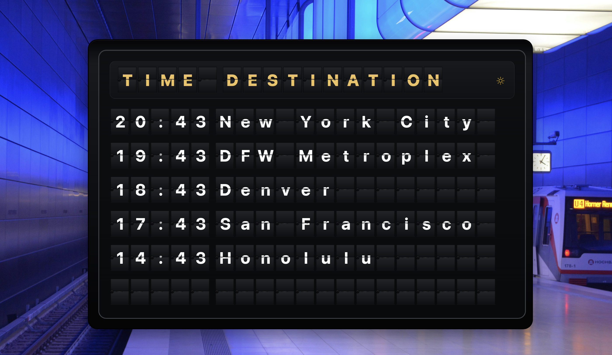
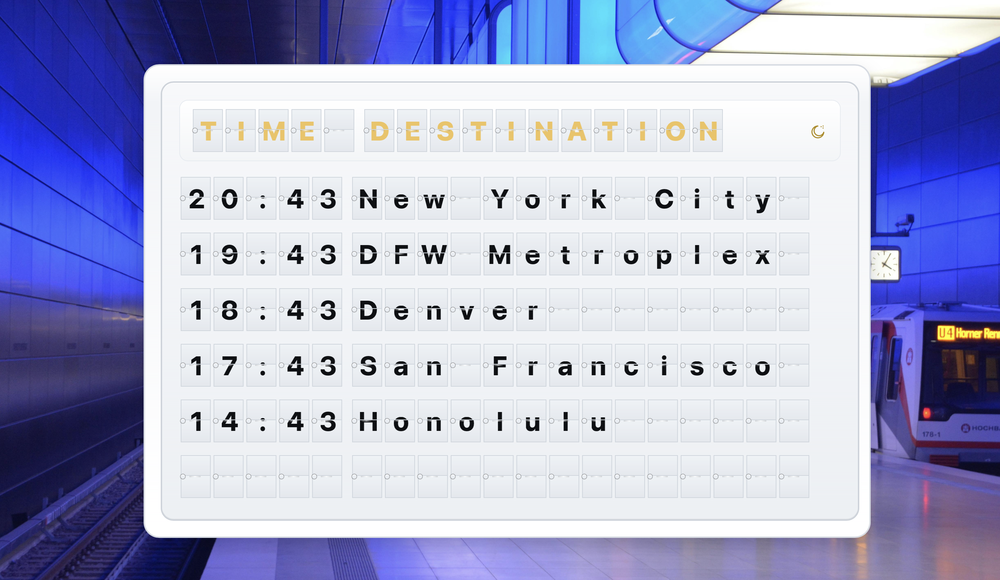
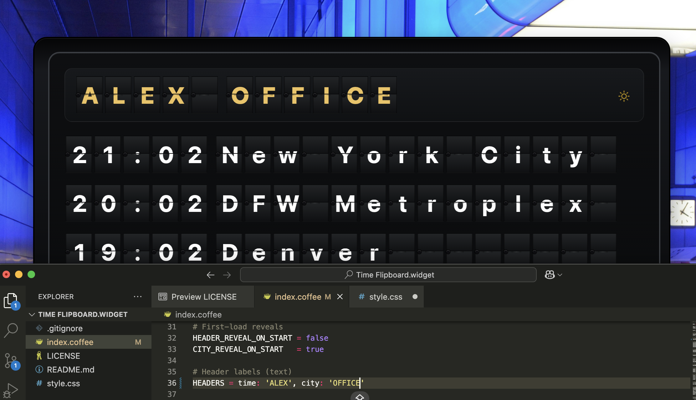
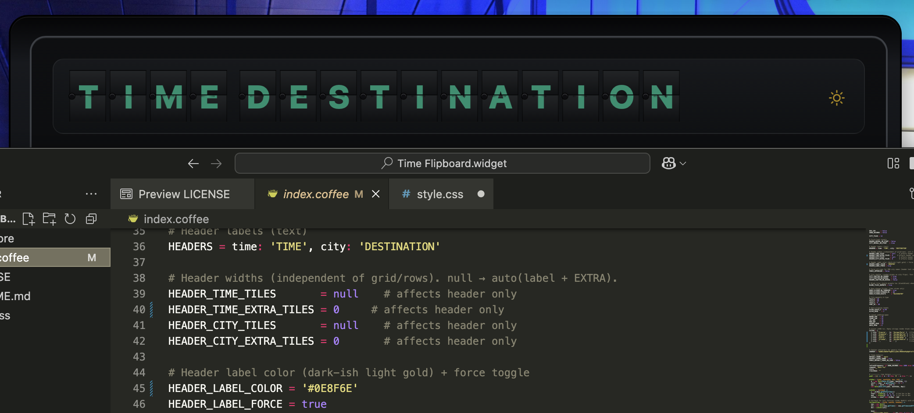
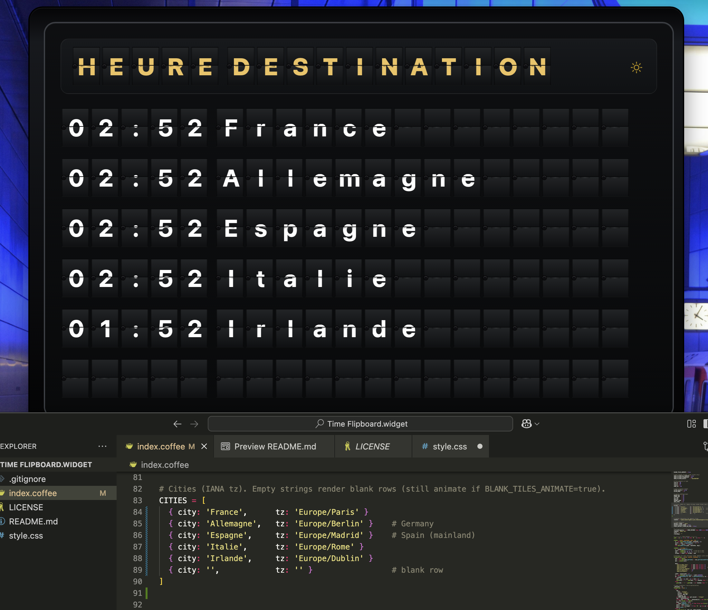
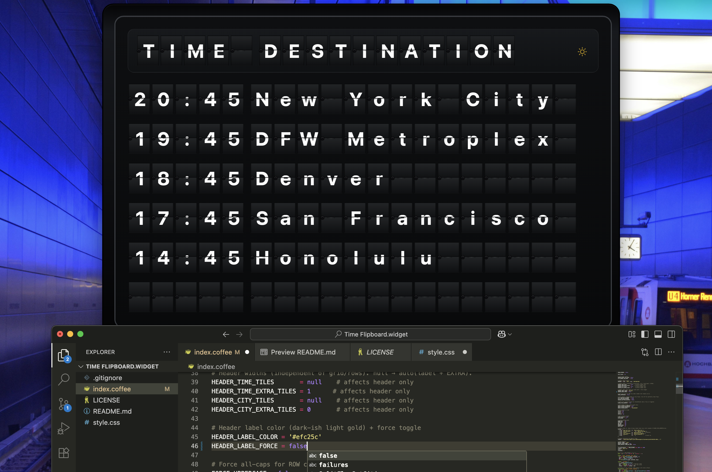

# Time Flipboard — Version 1.5

A retro split-flap **TIME | DESTINATION** board for [Übersicht](https://tracesof.net/uebersicht/).  
Independent header sizing, day/night toggle (Tabler icons), header color override, optional blank‑tile animation, and hour‑rollover flicker. CoffeeScript + CSS.

---

## Gallery
<div align="center">

  <figure style="display:inline-block; width:49%; margin:0 0 16px;">
    
    <figcaption style="font-size:90%; margin-top:6px;">
      <strong>Dark mode</strong> — classic split-flap look with gold header labels.
    </figcaption>
  </figure>

  <figure style="display:inline-block; width:49%; margin:0 0 16px;">
    
    <figcaption style="font-size:90%; margin-top:6px;">
      <strong>Light mode</strong> — bright board, high-contrast row text.
    </figcaption>
  </figure>

  <figure style="display:inline-block; width:49%; margin:0 0 16px;">
    
    <figcaption style="font-size:90%; margin-top:6px;">
      <strong>Custom header</strong> — edit <code>HEADERS</code> and header-only tile counts.
    </figcaption>
  </figure>

  <figure style="display:inline-block; width:49%; margin:0 0 16px;">
    
    <figcaption style="font-size:90%; margin-top:6px;">
      <strong>Header colors</strong> — jade color example, but gold in dark by(override via CSS or <code>HEADER_LABEL_COLOR</code>).
    </figcaption>
  </figure>

  <figure style="display:inline-block; width:49%; margin:0 0 16px;">
    
    <figcaption style="font-size:90%; margin-top:6px;">
      <strong>French example</strong> — <code>HEURE</code> / <code>DESTINATION</code> with header room for longer labels.
    </figcaption>
  </figure>

  <figure style="display:inline-block; width:49%; margin:0 0 16px;">
    
    <figcaption style="font-size:90%; margin-top:6px;">
      <strong>Toggle custom CSS color.</strong> — header label & widths live near the top of <code>index.coffee</code>.
    </figcaption>
  </figure>

</div>


---

## Features
- **Independent header widths** — change header tile counts without affecting the grid below.
- **Day/Night theme toggle** — Tabler icon button in the header, persisted in `localStorage`.
- **Header color override** — gold by default; keep it consistent across themes or theme‑specific via CSS.
- **Blank‑tile animation** (optional) — blank tiles can flip (blank→blank) to feel alive.
- **Hour‑rollover flicker** (optional) — time tiles briefly show random digits at the top of each hour.
- **Clean flips** — city “chatter” can be turned off for pristine animations.
- **US fallback timekeeping** — when `Intl` is missing, static offsets cover major US zones (incl. Mountain & Phoenix).

---

## Install
1. Copy the folder **`Time Flipboard.widget`** into:
   ```
   ~/Library/Application Support/Übersicht/widgets/
   ```
2. Toggle the widget on in Übersicht.
3. Adjust **position/scale** at the top of `index.coffee` with `POS`.

---

## Quick start
- **Move/scale**: set
  ```coffeescript
  POS = x: 0, y: 0, z: 0, scale: 1
  ```
- **Add cities** (IANA time zones):
  ```coffeescript
  CITIES = [
    { city: 'New York City', tz: 'America/New_York' }
    { city: 'DFW Metroplex', tz: 'America/Chicago' }
    { city: 'Denver',        tz: 'America/Denver' }  # Mountain
    { city: 'San Francisco', tz: 'America/Los_Angeles' }
    { city: 'Honolulu',      tz: 'Pacific/Honolulu' }
    { city: '',              tz: '' }                # blank row (shows empty tiles)
  ]
  ```
- **12/24h**: `USE_12H = true` (12‑hour) or `false` (24‑hour).  
- **Seconds**: `SHOW_SECONDS = true` adds “:SS”.

---

## Headers (independent of the grid)
**Where to edit (`index.coffee`):**
```coffeescript
# Header labels (header tiles only)
HEADERS = time: 'TIME', city: 'YOUR DESTINATION'

# Header widths (affect header strip ONLY)
HEADER_TIME_TILES       = null    # or a number
HEADER_TIME_EXTRA_TILES = 4       # auto: label length + EXTRA
HEADER_CITY_TILES       = null    # or a number
HEADER_CITY_EXTRA_TILES = 2
```
> Increase `HEADER_CITY_EXTRA_TILES` to give longer labels (“Tiempo / Destino”, “Votre destination”) more room in the header without changing the grid below.

**Language quick‑recipes**
```coffeescript
# English
HEADERS = time: 'TIME', city: 'YOUR DESTINATION'

# French
HEADERS = time: 'HEURE', city: 'DESTINATION'   # or 'VOTRE DESTINATION'

# Spanish
HEADERS = time: 'HORA',  city: 'TU DESTINO'    # or 'SU DESTINO'
```

---

## Countries in Spanish (EU sample)
Replace your `CITIES` with a Spanish list (keeps same EU time zones):

```coffeescript
CITIES = [
  { city: 'Francia',   tz: 'Europe/Paris' }   # France
  { city: 'Alemania',  tz: 'Europe/Berlin' }  # Germany
  { city: 'España',    tz: 'Europe/Madrid' }  # Spain (mainland; Canary: Atlantic/Canary)
  { city: 'Italia',    tz: 'Europe/Rome' }    # Italy
  { city: 'Irlanda',   tz: 'Europe/Dublin' }  # Ireland
  { city: '',          tz: '' }               # blank row
]
```

To render all‑caps rows:
```coffeescript
FORCE_UPPERCASE = true
```

---

## Night & Day (Theme) toggle
- Click the **sun/moon** icon in the header to switch themes.
- Choice is saved in `localStorage` under key `splitflapTheme`.
- Defaults (top of file):
  ```coffeescript
  DEFAULT_THEME = 'dark'
  RESPECT_SAVED_THEME = true
  FORCE_DEFAULT_THEME_ON_LOAD = false  # set true to ignore saved and force default each load
  ```
**Lock the theme (optional):** set `FORCE_DEFAULT_THEME_ON_LOAD = true` and hide the toggle button via CSS or comment out its HTML.

---

## Customizing colors
### Header label color (global override)
```coffeescript
HEADER_LABEL_COLOR = '#efc25c'  # gold by default
HEADER_LABEL_FORCE = true       # apply to both light & dark
```

### Theme‑specific header colors (per‑theme CSS)
For example: **jade** in light mode, **gold** in dark mode.
```coffeescript
HEADER_LABEL_FORCE = false  # let CSS control per theme
```
```css
/* Add to your CSS block */
.theme-light .header .glyph { color: #0E8F6E !important; } /* Jade */
.theme-dark  .header .glyph { color: #efc25c !important; } /* Gold */
.theme-light .theme-toggle  { color: #0E8F6E; }            /* match toggle accent */
```

### Row text color (advanced)
```css
.theme-dark .glyph { color: #ffffff; }
.theme-light .glyph { color: #0e1013; }
```

---

## Animations & behavior
- **Blank rows**  
  If you want empty rows to still “move”:
  ```coffeescript
  BLANK_TILES_ANIMATE = true  # flips blank→blank on reveals/changes
  ```
- **City chatter (random overlay while flipping)**  
  Turn chatter off for perfectly clean flips:
  ```coffeescript
  CITY_CHATTER_ON_REVEAL = false
  CITY_CHATTER_ON_CHANGE = false
  ```
- **Hour‑rollover flicker (time only)**  
  Makes the time column briefly flip with random digits at each hour change:
  ```coffeescript
  HOUR_FLICKER_ON_TURNOVER = true
  HOUR_FLICKER_STAGGER_MS  = 60
  HOUR_FLICKER_DIGITS      = "0123456789"
  ```

---

## Positioning & layout tips
- **Scale**: `POS.scale` (e.g., `1.2`) scales the whole board.
- **Font size**: `FONT_SZ = 40` (default). If letters clip, you can also adjust:
  ```coffeescript
  GLYPH_SCALE_X = 0.96
  GLYPH_HPAD    = 2
  ```
- **Make room in header**: increase `HEADER_*_EXTRA_TILES`.
- **Extend city width**: increase `CITY_TILES` (grid‑wide).

---

## Runtime APIs (Console helpers)
```js
// Replace rows at runtime
SplitFlapSetCities([
  { city:'Paris', tz:'Europe/Paris' },
  { city:'Tokyo', tz:'Asia/Tokyo' }
]);

// Change header labels at runtime
SplitFlapSetHeaders({ time:'Tiempo', city:'Destino' });
```

---

## Performance tips
- `SHOW_SECONDS = false` reduces update frequency and animations.
- Turn off chatter: `CITY_CHATTER_ON_* = false`.
- Keep `CITIES` list reasonable; more rows = more DOM.
- If macOS feels laggy: reduce `FONT_SZ`, or lower animation staggering values.

---

## Fallback timekeeping (when Intl fails)
The widget uses `Intl.DateTimeFormat` when available. A US‑only static fallback supports:
- `America/New_York`, `America/Chicago`, `America/Denver`, `America/Los_Angeles`, `Pacific/Honolulu`, and `America/Phoenix` (no DST).
You can extend the `base` offset map in `fallbackTime` if needed.

---

## License
[MIT](./LICENSE). Includes Tabler Icons (MIT‑compatible).

---

## Credits
- [Tabler Icons](https://tabler.io/icons) — theme toggle icons.
- Übersicht by Felix Hageloh.
